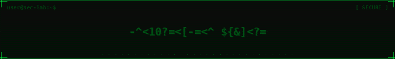

#  Hey, I'm Thembinkosi Madiba

---

## About Me

Aspiring SOC Analyst and software developer based in South Africa. My focus is on building a strong foundation in cybersecurity through hands-on labs, practical experimentation, and continuous learning.

I'm driven by curiosity understanding how systems work, how they can be exploited, and how to defend them effectively. Alongside my security studies, I use my development background to build tools that support security workflows and investigations.

---

## 🛠️ Security Tools & Environments

**Learning Platforms**

---

## 💻 Software Development

My development skills complement my cybersecurity path. I use them to build security-focused tools such as automation scripts, threat analysis utilities, security dashboards, and web-based investigative tools.

**Languages**

**Frameworks & Tools**

---

## 📚 

- Preparing for CompTIA Security+
- Security concepts: access control, authentication, encryption
- Understanding computer components: CPU, RAM, GPU, motherboard, storage
- Building and assembling PCs
- Maintenance and repair of peripherals

---

## 🎯 Goals

I'm working toward a career in cybersecurity whether as a SOC Analyst, IT Technicial, or Security Engineer. My aim is to combine deep technical security knowledge with my software development skills to build tools and systems that make a real difference.

I'm not rushing the process. I'm focused on building genuine skills through honest, consistent practice.

---

*Learning. Building. Improving.*

