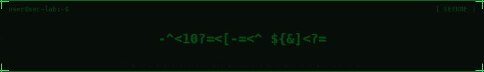

#  Hey, I'm Thembinkosi Madiba

---

## About Me

I'm Thembinkosi Madiba, a BCom Information Systems graduate (University of Johannesburg, 2026) from South Africa, transitioning into cybersecurity with a focus on GRC, technology risk, information security, identity & access management, and data governance.

I currently work as an IT Support / CX Intern at CX Experts (in partnership with CAPACITI), handling live support tickets in Zendesk, troubleshooting authentication and account-access issues, and working against SLA requirements hands-on experience with real systems and real users.

I recently became **Microsoft Certified: Security, Compliance, and Identity Fundamentals (SC-900)**, and I'm putting those concepts into practice through hands-on projects with Microsoft Entra ID and Microsoft Purview. I'm currently studying toward CompTIA Security+.

My Information Systems background gave me a working foundation in how organizations design, run, and depend on technology which is what first drew me to the risk and compliance side of security. I'm interested not just in how systems can be attacked, but in how organizations govern and reduce that exposure using frameworks like NIST, ISO 27001, and COBIT.

---

## 🔐 Featured Project

### Microsoft Purview Data Governance & DLP Lab — CAPTCHA Technologies

A hands-on, simulated enterprise GRC and data-protection environment built on a live Microsoft Entra ID tenant + Microsoft 365 E5 trial. Every control is tied to a documented risk, every test result is logged PASS/FAIL/PARTIAL, and real issues encountered along the way are documented rather than hidden.

**What I built:**
- **Identity & Access Management** — 5 fictional department users mapped 1:1 to mail-enabled Entra ID security groups (HR, Finance, Sales, IT, Security-GRC); access granted at group level only, implementing least privilege by design
- **Data Classification** — a 4-tier sensitivity label model (Public → Internal → Confidential → Highly Confidential) in Microsoft Purview, with protection scaling to risk level
- **Data Loss Prevention** — a custom DLP policy combining label-based and content-based detection, deployed in simulation mode, with 2 independent tests executed and passed
- **Audit & Investigation** — a full incident investigation (INC-001) built on a three-artifact evidence chain, with a follow-up addendum
- **Risk & Control Management** — a risk register scoring 5 real risks, and a control matrix mapping 5 controls to risk, technology, and evidence
- **Testing** — a consolidated test plan across every phase: 12 tests total, 10 PASS, 0 FAIL, 2 PARTIAL

`Data Governance` `IAM` `Least Privilege` `RBAC` `Data Classification` `Sensitivity Labels` `DLP` `Information Protection` `Audit` `Risk Management` `GRC`

---

## 📜 Certifications

**Microsoft Certified: Security, Compliance, and Identity Fundamentals (SC-900)** 🥇

- IBM Cybersecurity Compliance Framework, Standards & Regulations
- Google IT Support Professional Certificate
- AWS Cloud Practitioner Essentials
- Cisco Introduction to Cybersecurity

Additional Learning

 

- Google AI Essentials
- Python for Data Science and AI
- Google Introduction to Generative AI
- Google Use AI Responsibly
- Google Stay Ahead of the AI Curve

---

## 🛠️ Security Tools & Environments

**Concepts:** IAM · RBAC · Least Privilege · Data Governance · DLP · Information Protection · Audit & Monitoring · Risk Management · Compliance · NIST · ISO 27001 · COBIT · ITGC · CIA Triad · Zero Trust

**Learning Platforms**

---

## 💻 Software Development

Development is a supporting skill set, not my primary direction — I use it to build security-focused tools such as automation scripts, threat analysis utilities, security dashboards, and web-based investigative tools.

**Languages**

**Frameworks & Tools**

---

##  Currently Learning

**CompTIA Security+ (SY0-701)** — *in progress, not yet certified*

- 🔐 General Security Concepts
- ⚠️ Threats, Vulnerabilities & Mitigations
- 🏗️ Security Architecture
- 🛡️ Security Operations
- 📋 Security Program Management & Governance

### Key Topics
- CIA Triad & AAA
- Cryptography (PKI, Encryption, Hashing)
- Network & Endpoint Security
- Identity & Access Management (IAM)
- Incident Response & Digital Forensics
- Risk Management & Compliance
- Vulnerability Assessment & Security Monitoring
- Cloud, Virtualization & Zero Trust Security

---

## 🎯 Goals

I'm building a career at the intersection of cybersecurity, technology risk, governance, and security operations — targeting roles like Cybersecurity Analyst, SOC Analyst, GRC Analyst, Technology Risk Analyst, or IAM/Access Management, with IT support as a supporting path.

I'm developing both technical skills (identity, data protection, monitoring, security tooling) and governance-oriented skills (risk assessment, control mapping, compliance documentation), using my Information Systems background to understand security from both the technology and business sides.

I'm not rushing the process. I'm focused on building genuine skills through honest, consistent practice.

---

*Learning. Building. Securing.*

